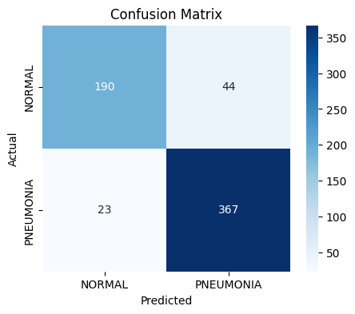
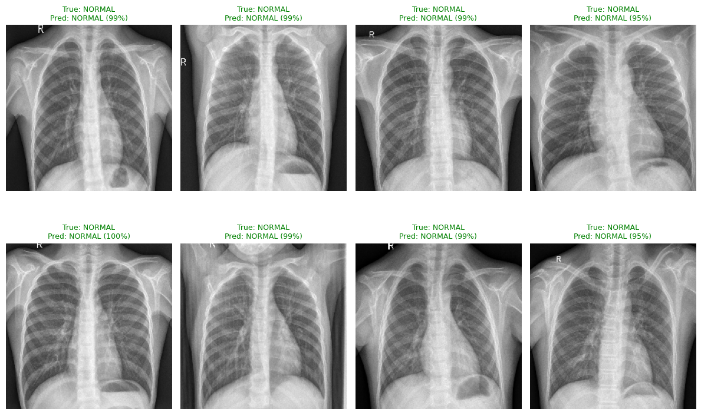

# chest-xray-pneumonia-detection
Binary CNN classifier that detects pneumonia in chest X-rays using MobileNetV2 transfer learning, with Grad-CAM visualizations for interpretability.
# Chest X-Ray Pneumonia Detection (CNN + Transfer Learning)

Binary CNN classifier that detects pneumonia in chest X-rays using MobileNetV2 transfer learning, with Grad-CAM visualizations for interpretability.

## Overview

This project builds a binary image classifier that distinguishes **pneumonia** from **normal** chest X-rays, using transfer learning on top of MobileNetV2 (pretrained on ImageNet).

## Dataset

[Chest X-Ray Images (Pneumonia)](https://www.kaggle.com/datasets/paultimothymooney/chest-xray-pneumonia) by Paul Mooney on Kaggle — approximately 5,800 labeled chest X-ray images.

## Model

- **Base model:** MobileNetV2 (frozen, pretrained on ImageNet)
- **Added layers:** Global average pooling → Dense(128, ReLU) → Dropout(0.3) → Dense(1, sigmoid)
- **Class imbalance** handled via computed class weights
- **Data augmentation:** rotation, zoom, and horizontal flip on training data

## Results

- **Test Accuracy:** _fill in your number here, e.g. 92.3%_

## Interpretability (Grad-CAM)

Beyond raw accuracy, this project includes Grad-CAM visualizations because interpretability matters especially in healthcare — a model that's "accurate" on paper can still be dangerous if it's making decisions for the wrong reasons. A CNN can learn to key off things that have nothing to do with disease, like scanner markings, positioning tubes, or dark corners of the image that happen to correlate with labels in the training data (a known failure mode called "shortcut learning"). Grad-CAM makes the model's reasoning visible by highlighting which pixels most influenced each prediction, so instead of trusting the output blindly, I could sanity-check whether it was actually looking at the lungs. _When I reviewed the heatmap output, the model's attention was primarily focused on ___._

## How to run

1. Open `pneumonia_detection.ipynb` in Google Colab
2. Set the runtime to a GPU (T4)
3. Get a Kaggle API token from kaggle.com/settings and upload it when prompted
4. Run all cells top to bottom

## Requirements

See `requirements.txt`
